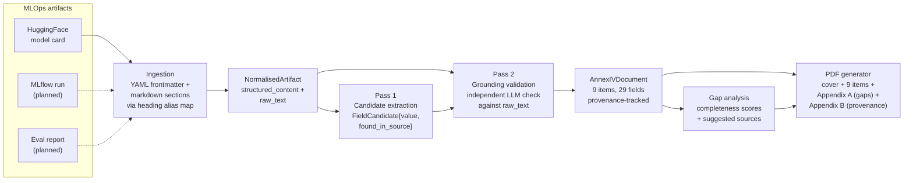

# AI Act Annex IV Compliance Copilot

Generates EU AI Act Annex IV technical documentation from MLOps artifacts (HuggingFace model cards, with MLflow runs and eval reports planned). Two-pass LLM extraction with independent grounding validation: every populated field carries provenance back to the source artifact, and ungrounded values are structurally rejected before reaching the output.

*Build a verifiable compliance document instead of a fabricated one.*


## Headline results

Benchmarked on 10 HuggingFace models with public model cards across diverse domains (NLP, vision, audio, biomedical, content moderation, embeddings, sentiment, summarization).

| Metric | Two-pass system | LLM-only baseline |
|---|---|---|
| Mean completeness | 28% | 46% |
| Mean required-field completeness | 28% | 47% |
| Mean fields per document (of 29) | 8.2 | 13.4 |
| **Hallucination rate** | **0% (by design)** | **37%** |
| Mean time per document | 57s | 32s |
| Estimated cost per document | $0.0167 | $0.0084 |

28% completeness is the honest ceiling for public model cards. Annex IV has 29 fields across nine items, but items 5 (risk management per Article 9), 8 (EU declaration of conformity per Article 47), and 9 (post-market monitoring per Article 72) describe internal compliance processes that do not exist on HuggingFace. Items 6 (lifecycle changes) and 7 (harmonised standards) are similarly absent from public artifacts. These fields are structurally unreachable from a model card alone -- filling them requires internal documentation that the system is designed to ingest once MLflow and eval report loaders are implemented.

The architecture's value is not absolute completeness -- it is invariance across input quality. The baseline hallucination rate ranges from 0% on `facebook/bart-large-cnn` (a thorough model card where the LLM happens to extract only grounded values) to 62% on `sentence-transformers/all-MiniLM-L6-v2` (a minimal card where the LLM fills 13 fields but only 5 are grounded). The two-pass system rejects the same ungrounded fields regardless of whether the model card is comprehensive or sparse. The cost of this invariance is 18 LLM calls per document instead of 9, and ~57s instead of ~32s -- paid explicitly for grounding rigor.

Per-model results are in [`benchmark/results/per_model.json`](benchmark/results/per_model.json). The benchmark is reproducible: `compliance-copilot benchmark` re-runs extraction across all 10 models with artifact caching.

## Architecture



The key design decision is the separation between Pass 1 and Pass 2. Pass 1 returns `FieldCandidate{value, found_in_source}` via structured outputs -- never the final `DocumentedField` directly. Pass 2 is the only code path that can mark a field as `status='filled'`, and it requires its own independent grounding-check LLM call against the raw source text before attaching a `Provenance` object. The LLM never has authority to mark a field as filled. Fabrication is structurally impossible, not policy-prohibited.

## Two-pass extraction in detail

### Pass 1: Candidate extraction

For each of the nine Annex IV items, a per-item system prompt (composed from the regulation text in `src/annex_iv/reference/item_N.md` and a field specification with positive/negative examples) is sent alongside the full artifact text. The LLM returns an `instructor`-validated Pydantic model where every field is a `FieldCandidate{value: str | None, found_in_source: bool}`. Fields where the LLM reports `found_in_source=False` or returns a null value are immediately marked `status='unavailable'`. Fields with a candidate value are marked `status='pending'` -- they have not yet been validated.

### Pass 2: Grounding validation

Every `pending` field from Pass 1 is submitted to a second, independent LLM call. This call receives only the candidate value and the raw source text, and returns a `GroundingCheck{grounded: bool, locator: str | None, reasoning: str}`. If `grounded=True`, the field is promoted to `status='filled'` with a `Provenance` object recording the source artifact URI, the locator within the text, the extraction timestamp, and the model used. If `grounded=False`, the field is dropped to `status='unavailable'` and routed to the gap report. The two LLM calls see different prompts and make independent judgments.

18 LLM calls per document (9 items x 2 passes). Single-pass would be 9 calls, but every populated field would be one LLM call away from fabrication. The cost is paid explicitly for grounding rigor.

## Quickstart

```bash
git clone https://github.com/AdityaShekhawat0504/ai-act-compliance-copilot.git
cd ai-act-compliance-copilot
uv sync
export OPENAI_API_KEY="sk-..."
uv run compliance-copilot generate google/gemma-2b -o output/
```

```
Loading artifact from huggingface://google/gemma-2b...
Item 1/9: 6 filled, 5 unavailable
Item 2/9: 2 filled, 6 unavailable
Item 3/9: 1 filled, 3 unavailable
Item 4/9: 0 filled, 1 unavailable
Item 5/9: 0 filled, 1 unavailable
Item 6/9: 0 filled, 1 unavailable
Item 7/9: 0 filled, 1 unavailable
Item 8/9: 0 filled, 1 unavailable
Item 9/9: 0 filled, 1 unavailable

Annex IV compliance: 9/29 fields filled (31%). Required-field completeness: 38%. 20 gaps identified across items [1, 2, 3, 4, 5, 6, 7, 8, 9].
Gaps: 20

Output files:
  output/google__gemma-2b.annex_iv.json
  output/google__gemma-2b.gap_report.json
  output/google__gemma-2b.summary.txt
  output/google__gemma-2b.pdf
```

Four output files per model: the full Annex IV document as provenance-tracked JSON, a structured gap report identifying missing fields with suggested artifact sources, a human-readable summary, and a PDF documentation package with cover page, nine item sections, Appendix A (gap analysis), and Appendix B (provenance audit trail).

To re-analyze a previously generated document without re-running extraction (no API cost):

```bash
uv run compliance-copilot report output/google__gemma-2b.annex_iv.json
```

To run the full 10-model benchmark (~30 minutes, ~$0.20 in OpenAI tokens):

```bash
uv run compliance-copilot benchmark
```

## What's in the repo

```
src/
    annex_iv/
        __init__.py
        schema.py                   # Pydantic v2 models for items 1-9, DocumentedField, Provenance
        reference/
            item_1.md .. item_9.md  # Regulation text per item
    ingestion/
        __init__.py
        base.py                     # NormalisedArtifact + ArtifactLoader ABC
        huggingface.py              # HuggingFace model card parser
        mlflow.py                   # (planned)
        eval_report.py              # (planned)
    extraction/
        __init__.py
        pipeline.py                 # Two-pass extraction orchestrator
        prompts.py                  # Per-item system prompts + grounding validator prompt
        validators.py               # Pass 2 grounding validation (GroundingCheck model)
    gap_analysis/
        __init__.py
        analyzer.py                 # Completeness scoring, gap identification, field metadata
    output/
        __init__.py
        pdf.py                      # PDF generation via reportlab.platypus
        audit_trail.py              # (planned)
    cli.py                          # Typer CLI: generate, report, benchmark, version

benchmark/
    __init__.py
    baseline.py                     # Single-pass LLM-only extraction (no grounding)
    models.yaml                     # 10 curated HuggingFace models
    run_benchmark.py                # Orchestrator: runs both pipelines, measures metrics
    results/
        per_model.json              # Per-model completeness, hallucination, timing
        aggregate.json              # Mean/median across all models
        README_SNIPPET.md           # Auto-generated benchmark table

tests/
    __init__.py
    fixtures/
        huggingface/
            nlp_thorough.json       # Cached model card with comprehensive sections
            vision.json             # Cached vision model card
            minimal.json            # Cached minimal model card
    test_schema.py                  # 15 tests: field validation, round-trip serialization
    test_ingestion.py               # 18 tests: HF parser, section extraction, frontmatter
    test_extraction.py              # 13 tests: Pass 1 candidates, Pass 2 validation, orchestrator
    test_gap_analysis.py            # 22 tests: completeness scoring, metadata coverage, helpers
    test_cli.py                     # 10 tests: generate, report, version, error handling
    test_pdf.py                     # 13 tests: PDF structure, edge cases, CLI flags
    test_benchmark.py               # 13 tests: baseline, aggregation, README snippet, CLI
```

## Regulatory alignment

Source: [Regulation (EU) 2024/1689](https://eur-lex.europa.eu/eli/reg/2024/1689/oj) (EU AI Act), published in OJ L, 12 July 2024. Annex IV specifies the technical documentation required under Article 11(1) for high-risk AI systems.

| Annex IV item | Description | Schema model |
|---|---|---|
| 1 | General description of the AI system | `AnnexIVItem1General` |
| 2 | Elements of the system and development process | `AnnexIVItem2Development` |
| 3 | Monitoring, functioning and control | `AnnexIVItem3MonitoringControl` |
| 4 | Appropriateness of performance metrics | `AnnexIVItem4PerformanceMetrics` |
| 5 | Risk management system (Article 9) | `AnnexIVItem5RiskManagement` |
| 6 | Relevant changes through the lifecycle | `AnnexIVItem6LifecycleChanges` |
| 7 | Harmonised standards applied | `AnnexIVItem7HarmonisedStandards` |
| 8 | EU declaration of conformity (Article 47) | `AnnexIVItem8DeclarationOfConformity` |
| 9 | Post-market monitoring system (Article 72) | `AnnexIVItem9PostMarketMonitoring` |

## Stack

Python 3.11 · uv · Pydantic v2 · instructor · OpenAI gpt-4o-mini · huggingface_hub · reportlab · typer · pypdf · pytest

## Limitations

- **28% completeness ceiling on public model cards.** Annex IV items 5, 8, and 9 require internal documentation (risk management plans, declarations of conformity, post-market monitoring systems) that does not exist on HuggingFace. Multi-artifact ingestion is the path to higher completeness.
- **Single-artifact ingestion only.** The current pipeline processes one HuggingFace model card per run. Multi-artifact fusion (model card + MLflow run + eval report) is the next architectural extension -- the `NormalisedArtifact` schema and loader ABC are designed for it.
- **Binary grounding judgment.** Pass 2 returns `grounded: bool`. Confidence scores are recorded in `Provenance.confidence` but not yet used to weight downstream decisions or produce partial-credit completeness scores.
- **English-only.** Regulation text, extraction prompts, and PDF output are in English. The EU AI Act applies across all 24 official EU languages.

## Author

**Aditya Singh Shekhawat** -- B.Sc. Applied Artificial Intelligence at Technische Hochschule Rosenheim, focused on RegTech, AML, and AI governance tooling. [LinkedIn](https://www.linkedin.com/in/aditya-singh-shekhawat/).

## License

MIT. This is a portfolio demonstration of automated regulatory documentation extraction, not legal advice, and not a substitute for professional regulatory assessment under Regulation (EU) 2024/1689.
